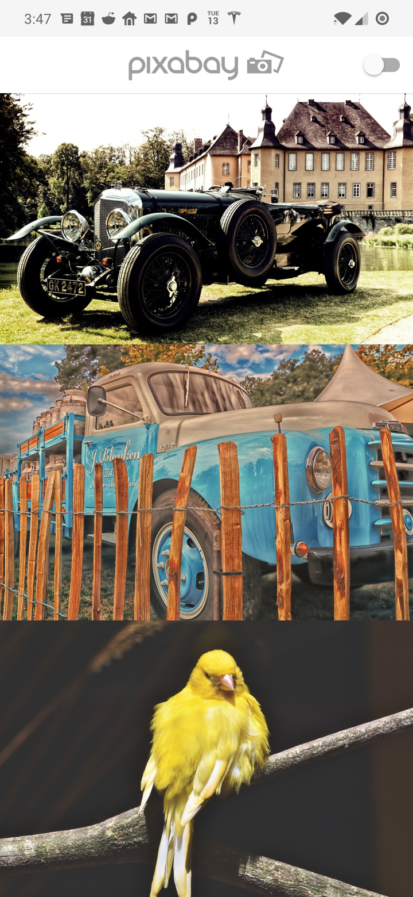

# Flutter Architecture Demo

A Flutter application to demo scalable architecture.

## Getting Started

This project is a sample application that demonstrates a scalable architecture. 

The example application points the the [Pixabay](https://pixabay.com/service/about/api/) api. To run the application successfully
add your api key to the **ApiService.dart** class. 

This is not intended to be a full featured application. 

## Key concepts

*  ApiService
*  Providers
*  Repositories
*  Bloc
*  UI

Each layer only talks to the outer layer and UI is separated between [BLOCs](https://felangel.github.io/bloc/#/) and Widgets.

#### Api Service
A class to manage communication to the outside world using [Dio](https://pub.dev/packages/dio). Dio is used because it is generally awesome
and full featured. Interceptors can be used easily and has a similar api to OkHttp. I've kept the ApiService class pretty simple but is expected to 
get more complex as apps get more interesting. 

#### Providers
A set of classes that manage the GET, PUT, POST, DELETE, Etc. These are usually pretty straightforward and do not do a log of business logic. In general
Providers are the only class type that talks to the ApiService. Providers can also talk to [SharePreferences](https://pub.dev/packages/shared_preferences) or other sources of data. 

#### Repositories
A set of classes that talk to the providers. Repositories may talk to several providers to produce a set of data that the BLOCs can make useful. A repository may 
ask for data from a share preferences provider to grab a locally stored value and then talk to an api, sending the result back to a BLOC.

#### Bloc
Also known as Business Logic Components. Blocs help keep state out of the UI by producing State objects for the UI to display. The UI produces Events that 
the Bloc can act upon. As an application grows more complex using Bloc is arguably one of the best ways to structure an app around. The learning 
curve is larger than [ScopedModel](https://pub.dev/packages/scoped_model) but from my experience scales better.  

#### UI
The UI is just Widgets, Flutter is just Widgets and its fantastic!

## Features

Out of the box features supported are: 

*  Light & Dark mode
*  Dependency Injection
*  Localization
*  Photos show up if you have added your api key
*  General idea of how to handle errors in BLOC
*  Loads photos from Pixabay
